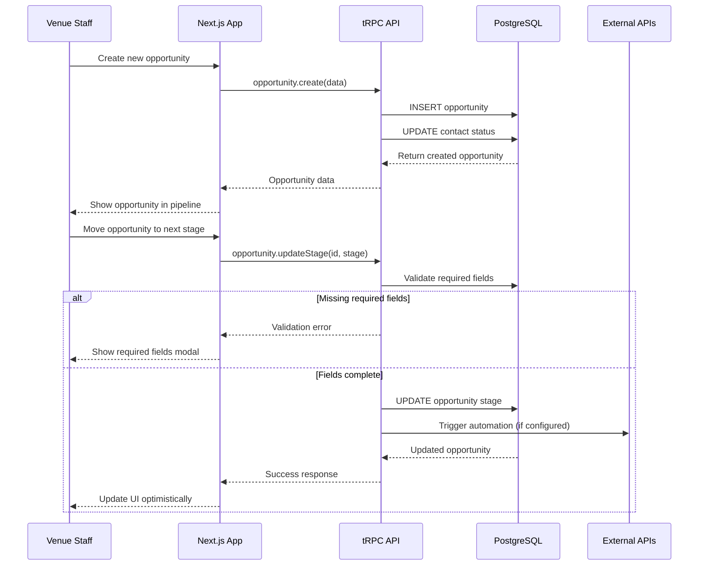
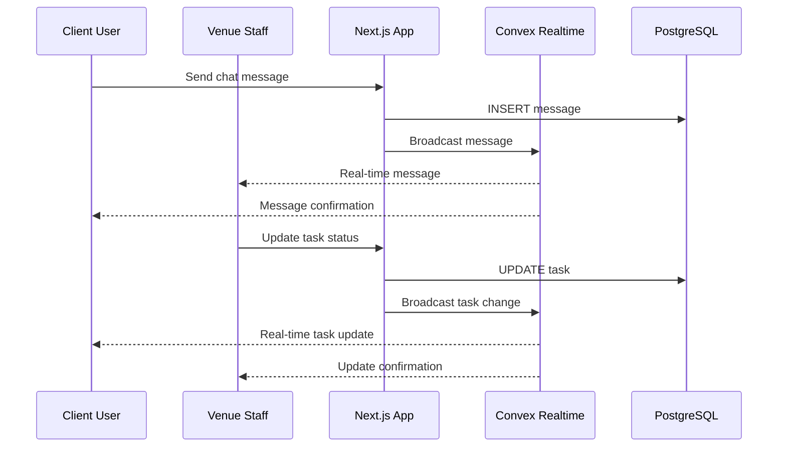

# Core Workflows

## Sales Pipeline Workflow

```mermaid
sequenceDiagram
    participant User as Venue Staff
    participant App as Next.js App
    participant tRPC as tRPC API
    participant DB as PostgreSQL
    participant External as External APIs
    
    User->>App: Create new opportunity
    App->>tRPC: opportunity.create(data)
    tRPC->>DB: INSERT opportunity
    tRPC->>DB: UPDATE contact status
    DB-->>tRPC: Return created opportunity
    tRPC-->>App: Opportunity data
    App-->>User: Show opportunity in pipeline
    
    User->>App: Move opportunity to next stage
    App->>tRPC: opportunity.updateStage(id, stage)
    tRPC->>DB: Validate required fields
    alt Missing required fields
        tRPC-->>App: Validation error
        App-->>User: Show required fields modal
    else Fields complete
        tRPC->>DB: UPDATE opportunity stage
        tRPC->>External: Trigger automation (if configured)
        DB-->>tRPC: Updated opportunity
        tRPC-->>App: Success response
        App-->>User: Update UI optimistically
    end
```

## Real-time Project Collaboration

```mermaid
sequenceDiagram
    participant Client as Client User
    participant Staff as Venue Staff  
    participant App as Next.js App
    participant Convex as Convex Realtime
    participant DB as PostgreSQL
    
    Client->>App: Send chat message
    App->>DB: INSERT message
    App->>Convex: Broadcast message
    Convex-->>Staff: Real-time message
    Convex-->>Client: Message confirmation
    
    Staff->>App: Update task status
    App->>DB: UPDATE task
    App->>Convex: Broadcast task change
    Convex-->>Client: Real-time task update
    Convex-->>Staff: Update confirmation
```
