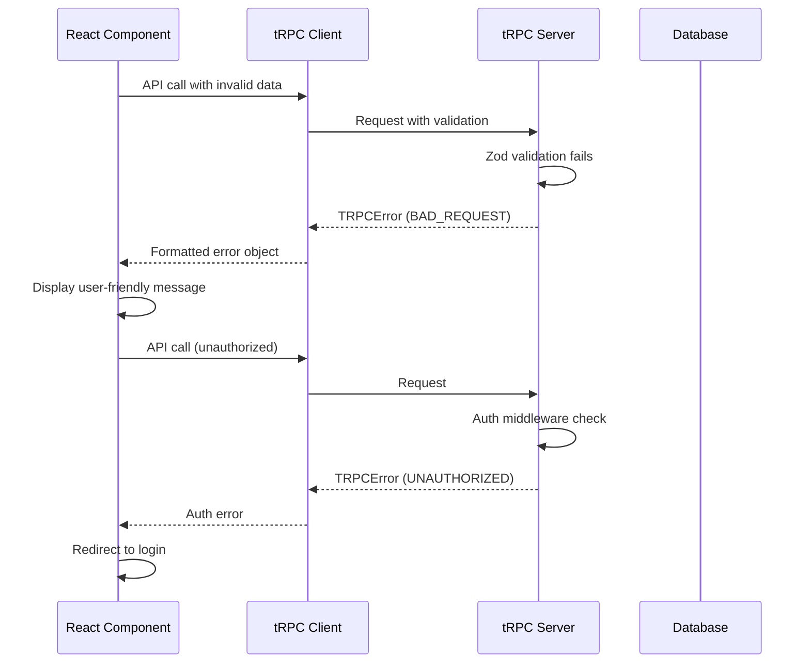

# Error Handling Strategy

## Error Flow


## Error Response Format
```typescript
interface ApiError {
  error: {
    code: 'BAD_REQUEST' | 'UNAUTHORIZED' | 'FORBIDDEN' | 'NOT_FOUND' | 'INTERNAL_SERVER_ERROR';
    message: string;
    data?: {
      code: string;
      httpStatus: number;
      stack?: string;
      path: string;
      zodError?: z.ZodError;
    };
  };
}
```

## Frontend Error Handling
```typescript
import { toast } from '@/components/ui/use-toast';

export const useErrorHandler = () => {
  const handleError = (error: unknown) => {
    if (error instanceof TRPCClientError) {
      switch (error.data?.code) {
        case 'UNAUTHORIZED':
          toast({
            title: 'Authentication Required',
            description: 'Please sign in to continue',
            variant: 'destructive',
          });
          // Redirect to login
          break;
        case 'FORBIDDEN':
          toast({
            title: 'Access Denied',
            description: 'You do not have permission for this action',
            variant: 'destructive', 
          });
          break;
        case 'BAD_REQUEST':
          toast({
            title: 'Invalid Input',
            description: error.message,
            variant: 'destructive',
          });
          break;
        default:
          toast({
            title: 'Something went wrong',
            description: 'Please try again later',
            variant: 'destructive',
          });
      }
    }
  };
  
  return { handleError };
};
```

## Backend Error Handling
```typescript
import { TRPCError } from '@trpc/server';
import { z } from 'zod';

export const contactRouter = createTRPCRouter({
  create: protectedProcedure
    .input(contactCreateSchema)
    .mutation(async ({ ctx, input }) => {
      try {
        // Validate user permissions
        if (!['ADMIN', 'SALES'].includes(ctx.session.user.role)) {
          throw new TRPCError({
            code: 'FORBIDDEN',
            message: 'Insufficient permissions to create contacts',
          });
        }
        
        // Check for duplicate email
        const existing = await ctx.db.contact.findUnique({
          where: { email: input.email },
        });
        
        if (existing) {
          throw new TRPCError({
            code: 'BAD_REQUEST',
            message: 'A contact with this email already exists',
          });
        }
        
        const contact = await ctx.db.contact.create({
          data: {
            ...input,
            venueId: ctx.session.user.venueId,
          },
        });
        
        return contact;
        
      } catch (error) {
        // Handle Convex errors
        if (error instanceof ConvexError) {
          throw new TRPCError({
            code: 'INTERNAL_SERVER_ERROR',
            message: 'Database error occurred',
            cause: error,
          });
        }
        
        // Re-throw tRPC errors
        if (error instanceof TRPCError) {
          throw error;
        }
        
        // Handle unexpected errors
        throw new TRPCError({
          code: 'INTERNAL_SERVER_ERROR',
          message: 'An unexpected error occurred',
          cause: error,
        });
      }
    }),
});
```
