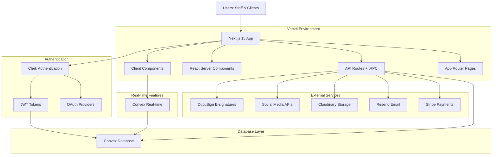

# High Level Architecture

## Technical Summary

The **eventRunner** application will be built as a **monolithic T3 Stack application** deployed on **Vercel**. The system consists of a **Next.js fullstack application** with integrated API routes using **tRPC** for type-safe client-server communication, **Convex** for database management and real-time features, and **Clerk** for authentication with JWT integration. This architecture is designed to support eventRunner's core mission of providing an all-in-one web application for event venue businesses, enabling efficient customer journey management, streamlined workflows, seamless collaboration, and timely revenue realization through a unified, type-safe development experience.

## Platform and Infrastructure Choice

**Platform:** Vercel (primary) with fallback to Azure
**Key Services:** 
- **Vercel**: Hosting, edge functions, static assets, CI/CD
- **Convex**: Database, real-time subscriptions, JWT authentication integration
- **Cloudinary**: File storage and image optimization
- **Resend**: Email delivery service
- **Stripe**: Payment processing

**Deployment Host and Regions:** Vercel edge network with European regions prioritized for Belgian user base compliance with GDPR data residency requirements.

## Repository Structure

**Structure:** Monorepo (T3 Stack approach)
**Monorepo Tool:** Built-in Next.js workspace capabilities
**Package Organization:** Single repository containing:
- `/src/app` - Next.js 15 App Router pages and layouts
- `/src/components` - Reusable UI components with shadcn/ui
- `/src/server` - tRPC routers and server-side logic
- `/src/lib` - Shared utilities and configurations
- `/convex` - Database schema and serverless functions

## High Level Architecture Diagram

## Architectural Patterns

- **Fullstack Framework Pattern:** Next.js provides unified frontend and backend in a single codebase
- **End-to-End Type Safety:** TypeScript + tRPC ensures type safety from database to UI
- **Server-First Architecture:** React Server Components for optimal performance
- **Component-Based UI:** shadcn/ui components with Tailwind CSS for consistent design
- **Database-First Design:** Convex schema drives TypeScript types and API structure
- **Authentication-as-a-Service:** Clerk handles all authentication flows with JWT integration
- **Real-time Communication:** Convex real-time for live chat and collaboration features
